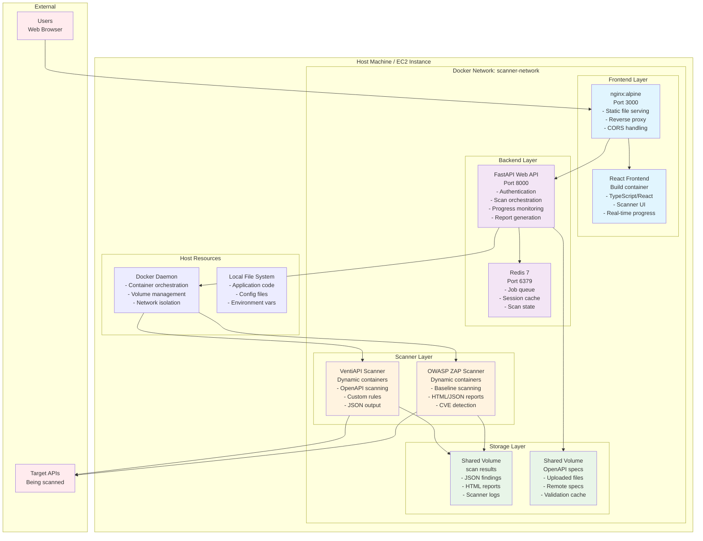

# VentiAPI Scanner Architecture Comparison

This document compares the current MVP Docker-based architecture with a proposed Kubernetes production architecture.

## Current MVP Architecture (Docker Compose)

### MVP Architecture Characteristics

**Deployment Model:**
- Single EC2 instance deployment
- Docker Compose orchestration
- Shared Docker daemon for scanner containers
- Direct volume mounts for data sharing

**Scalability:**
- Vertical scaling only (larger instance)
- Limited to single machine resources
- No load balancing across instances
- Manual scaling of scanner containers

**Security:**
- Container isolation via Docker
- Network segmentation with custom bridge
- Shared Docker socket (security risk)
- Basic environment variable secrets

**Operational Complexity:**
- Simple deployment with single script
- Manual monitoring and logging
- No built-in health checks
- Basic container restart policies

---

## Kubernetes Production Architecture

```mermaid
graph TB
    subgraph "Kubernetes Cluster"
        subgraph "Ingress Layer"
            INGRESS[Ingress Controller<br/>nginx-ingress<br/>- SSL termination<br/>- Load balancing<br/>- Rate limiting<br/>- DDoS protection]
            CERT[Cert Manager<br/>- Auto SSL/TLS<br/>- Let's Encrypt<br/>- Certificate rotation]
        end
        
        subgraph "Frontend Namespace"
            subgraph "Frontend Deployment"
                NGINX1[nginx Pod 1<br/>- Static assets<br/>- React build<br/>- Gzip compression]
                NGINX2[nginx Pod 2<br/>- Static assets<br/>- React build<br/>- Gzip compression]
                NGINX3[nginx Pod 3<br/>- Static assets<br/>- React build<br/>- Gzip compression]
            end
            
            FRONTSVC[Frontend Service<br/>ClusterIP<br/>- Load balancing<br/>- Health checks]
            FRONTCM[ConfigMap<br/>- nginx.conf<br/>- Environment config]
        end
        
        subgraph "Backend Namespace"
            subgraph "API Deployment"
                API1[FastAPI Pod 1<br/>- Scan orchestration<br/>- Authentication<br/>- Report generation]
                API2[FastAPI Pod 2<br/>- Scan orchestration<br/>- Authentication<br/>- Report generation]
                API3[FastAPI Pod 3<br/>- Scan orchestration<br/>- Authentication<br/>- Report generation]
            end
            
            APISVC[API Service<br/>ClusterIP<br/>- Load balancing<br/>- Health checks]
            APICM[ConfigMap<br/>- App configuration<br/>- Scanner settings]
            APISECRET[Secret<br/>- JWT keys<br/>- Admin credentials<br/>- Database passwords]
        end
        
        subgraph "Cache Namespace"
            subgraph "Redis Cluster"
                REDIS1[Redis Master<br/>- Job queue<br/>- Session cache<br/>- Scan state]
                REDIS2[Redis Replica 1<br/>- Read scaling<br/>- Failover backup]
                REDIS3[Redis Replica 2<br/>- Read scaling<br/>- Failover backup]
            end
            
            REDISSVC[Redis Service<br/>ClusterIP<br/>- Master/replica routing]
            REDISPVC[Redis PVC<br/>- Persistent storage<br/>- Data durability]
        end
        
        subgraph "Scanner Namespace"
            subgraph "Scanner Jobs"
                VENTIJOB[VentiAPI Jobs<br/>- Dynamic pod creation<br/>- Resource limits<br/>- Auto cleanup]
                ZAPJOB[ZAP Scanner Jobs<br/>- Dynamic pod creation<br/>- Resource limits<br/>- Auto cleanup]
                CUSTOMJOB[Custom Scanner Jobs<br/>- Pluggable scanners<br/>- Extensible framework]
            end
            
            SCANPVC[Scanner PVC<br/>- Shared results<br/>- Report storage<br/>- Spec cache]
            SCANCM[Scanner ConfigMap<br/>- Scanner configs<br/>- Rule definitions<br/>- Timeout settings]
        end
        
        subgraph "Database Namespace"
            subgraph "PostgreSQL Cluster"
                PGMASTER[PostgreSQL Master<br/>- User management<br/>- Scan metadata<br/>- Audit logs]
                PGREPLICA[PostgreSQL Replica<br/>- Read scaling<br/>- Backup target]
            end
            
            PGSVC[PostgreSQL Service<br/>- Connection pooling<br/>- Failover handling]
            PGPVC[PostgreSQL PVC<br/>- Data persistence<br/>- Backup storage]
            PGSECRET[DB Secret<br/>- Connection strings<br/>- User credentials]
        end
        
        subgraph "Monitoring Namespace"
            PROMETHEUS[Prometheus<br/>- Metrics collection<br/>- Alerting rules<br/>- Performance monitoring]
            GRAFANA[Grafana<br/>- Dashboards<br/>- Visualization<br/>- Alerting UI]
            JAEGER[Jaeger<br/>- Distributed tracing<br/>- Request tracking<br/>- Performance analysis]
        end
        
        subgraph "Logging Namespace"
            FLUENTD[Fluentd<br/>- Log aggregation<br/>- Log forwarding<br/>- Format parsing]
            ELASTICSEARCH[Elasticsearch<br/>- Log storage<br/>- Search indexing<br/>- Log retention]
            KIBANA[Kibana<br/>- Log visualization<br/>- Search interface<br/>- Log analysis]
        end
        
        subgraph "Storage Layer"
            STORAGECLASS[Storage Classes<br/>- SSD storage<br/>- Backup policies<br/>- Encryption at rest]
            VOLUMES[Persistent Volumes<br/>- Database storage<br/>- Shared results<br/>- Log retention]
        end
    end
    
    subgraph "External Services"
        USER[Users<br/>Web Browser<br/>Mobile Apps]
        TARGET[Target APIs<br/>Being scanned]
        EXTERNAL[External Services<br/>- LDAP/OAuth<br/>- Notification services<br/>- Backup storage]
    end
    
    subgraph "Infrastructure"
        LB[Load Balancer<br/>- Geographic distribution<br/>- Health checks<br/>- SSL termination]
        CDN[CDN<br/>- Static asset caching<br/>- Global distribution<br/>- DDoS protection]
        BACKUP[Backup Services<br/>- Database backups<br/>- Volume snapshots<br/>- Disaster recovery]
    end
    
    %% Connections
    USER --> LB
    LB --> CDN
    CDN --> INGRESS
    INGRESS --> FRONTSVC
    INGRESS --> APISVC
    
    FRONTSVC --> NGINX1
    FRONTSVC --> NGINX2 
    FRONTSVC --> NGINX3
    
    APISVC --> API1
    APISVC --> API2
    APISVC --> API3
    
    API1 --> REDISSVC
    API2 --> REDISSVC
    API3 --> REDISSVC
    
    API1 --> PGSVC
    API2 --> PGSVC
    API3 --> PGSVC
    
    API1 --> VENTIJOB
    API2 --> ZAPJOB
    API3 --> CUSTOMJOB
    
    VENTIJOB --> TARGET
    ZAPJOB --> TARGET
    CUSTOMJOB --> TARGET
    
    REDISSVC --> REDIS1
    REDISSVC --> REDIS2
    REDISSVC --> REDIS3
    
    PGSVC --> PGMASTER
    PGSVC --> PGREPLICA
    
    PROMETHEUS --> API1
    PROMETHEUS --> API2
    PROMETHEUS --> API3
    PROMETHEUS --> REDIS1
    PROMETHEUS --> PGMASTER
    
    FLUENTD --> ELASTICSEARCH
    ELASTICSEARCH --> KIBANA
    
    %% Styling
    classDef frontend fill:#e1f5fe
    classDef backend fill:#f3e5f5
    classDef scanner fill:#fff3e0
    classDef storage fill:#e8f5e8
    classDef monitoring fill:#fce4ec
    classDef external fill:#ffebee
    classDef infrastructure fill:#f1f8e9
    
    class NGINX1,NGINX2,NGINX3,FRONTSVC,FRONTCM frontend
    class API1,API2,API3,APISVC,APICM,APISECRET backend
    class VENTIJOB,ZAPJOB,CUSTOMJOB,SCANCM scanner
    class REDIS1,REDIS2,REDIS3,REDISSVC,REDISPVC,PGMASTER,PGREPLICA,PGSVC,PGPVC,PGSECRET,STORAGECLASS,VOLUMES,SCANPVC storage
    class PROMETHEUS,GRAFANA,JAEGER,FLUENTD,ELASTICSEARCH,KIBANA monitoring
    class USER,TARGET,EXTERNAL external
    class LB,CDN,BACKUP,INGRESS,CERT infrastructure
```

### Kubernetes Production Architecture Characteristics

**Deployment Model:**
- Multi-node Kubernetes cluster
- Namespace isolation for different components
- Horizontal pod autoscaling
- Rolling updates with zero downtime

**Scalability:**
- Horizontal scaling across multiple nodes
- Auto-scaling based on CPU/memory/custom metrics
- Load balancing at multiple layers
- Dynamic resource allocation

**Security:**
- Network policies for micro-segmentation
- RBAC for service account permissions
- Secrets management with encryption at rest
- Pod security policies and contexts
- No shared Docker socket exposure

**High Availability:**
- Multi-replica deployments
- Database clustering with failover
- Redis clustering for cache redundancy
- Cross-zone pod distribution
- Backup and disaster recovery

**Observability:**
- Comprehensive metrics collection
- Distributed tracing
- Centralized logging
- Real-time monitoring dashboards
- Automated alerting

**Operational Excellence:**
- GitOps deployment workflows
- Infrastructure as Code
- Automated health checks
- Self-healing infrastructure
- Compliance and audit trails

---

## Key Differences Summary

| Aspect | MVP (Docker Compose) | Production (Kubernetes) |
|--------|---------------------|------------------------|
| **Deployment** | Single instance | Multi-node cluster |
| **Scaling** | Vertical only | Horizontal + Vertical |
| **High Availability** | Single point of failure | Multi-replica redundancy |
| **Load Balancing** | nginx reverse proxy | Multi-layer load balancing |
| **Security** | Basic container isolation | Comprehensive security policies |
| **Monitoring** | Basic Docker logs | Full observability stack |
| **Data Persistence** | Docker volumes | Persistent Volume Claims |
| **Secrets Management** | Environment variables | Kubernetes Secrets + encryption |
| **Network Security** | Docker networks | Network policies + service mesh |
| **Disaster Recovery** | Manual backups | Automated backup/restore |
| **Cost** | Low (single instance) | Higher (cluster overhead) |
| **Complexity** | Low | High |
| **Time to Deploy** | Minutes | Hours/Days |
| **Maintenance** | Manual | Automated with operators |

## Migration Path

1. **Phase 1**: Containerize all components (✅ Complete)
2. **Phase 2**: Add health checks and proper configuration management
3. **Phase 3**: Implement database persistence (PostgreSQL)
4. **Phase 4**: Deploy to Kubernetes with basic scaling
5. **Phase 5**: Add monitoring and logging stack
6. **Phase 6**: Implement advanced security policies
7. **Phase 7**: Add CI/CD pipelines and GitOps
8. **Phase 8**: Implement disaster recovery and multi-region deployment

## Recommendations

**For MVP/Development**: 
- Current Docker Compose architecture is appropriate
- Focus on feature completeness and stability
- Add basic health checks and monitoring

**For Production**:
- Kubernetes architecture provides enterprise-grade capabilities
- Implement gradually following the migration path
- Consider managed Kubernetes services (EKS, GKE, AKS) to reduce operational overhead
- Invest in proper CI/CD and monitoring before full production deployment