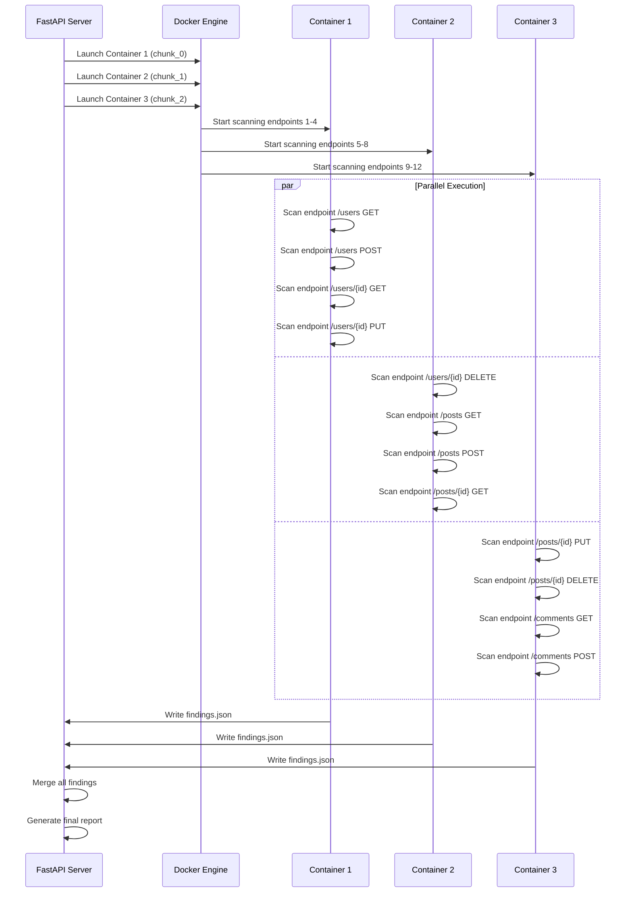

# Parallel Scanning Orchestration

This document provides a detailed technical explanation of how the VentiAPI Scanner orchestrates parallel scanning operations, including endpoint splitting, container management, and result aggregation.

## Overview

The VentiAPI Scanner uses a sophisticated orchestration system to automatically:
1. **Split large API specifications** into smaller, manageable chunks
2. **Launch multiple Docker containers** to scan chunks in parallel
3. **Monitor progress** across all containers in real-time
4. **Aggregate results** from all containers into unified reports

## Table of Contents

- [System Architecture](#system-architecture)
- [Orchestration Flow](#orchestration-flow)
- [Endpoint Splitting Algorithm](#endpoint-splitting-algorithm)
- [Parallel Container Management](#parallel-container-management)
- [Progress Monitoring System](#progress-monitoring-system)
- [Result Aggregation](#result-aggregation)
- [Performance Characteristics](#performance-characteristics)
- [Error Handling & Resilience](#error-handling--resilience)
- [Configuration Parameters](#configuration-parameters)

## System Architecture

```
┌─────────────────────────────────────────────────────────────────┐
│                    FastAPI Web API Server                      │
├─────────────────────────────────────────────────────────────────┤
│  OpenAPI Spec Upload & Analysis                               │
│  ├─ split_openapi_spec_by_endpoints()                         │
│  └─ Chunk Size: 4 endpoints per container                     │
├─────────────────────────────────────────────────────────────────┤
│  Parallel Execution Engine                                    │
│  ├─ execute_secure_scan() - Main Orchestrator                 │
│  ├─ run_single_scanner_chunk() - Per-Container Logic          │
│  └─ asyncio.gather() - Parallel Task Management               │
├─────────────────────────────────────────────────────────────────┤
│  Real-Time Progress Monitoring                                │
│  ├─ monitor_chunk_progress() - Per-Container Monitoring       │
│  ├─ update_overall_scan_progress() - Aggregated Progress      │
│  └─ WebSocket-style Status Updates                            │
├─────────────────────────────────────────────────────────────────┤
│  Result Aggregation                                           │
│  ├─ merge_scan_findings() - Finding Consolidation             │
│  └─ Report Generation & File Management                       │
└─────────────────────────────────────────────────────────────────┘
                                 │
                                 ▼
┌─────────────────────────────────────────────────────────────────┐
│              Docker Container Cluster                          │
├─────────────────┬─────────────────┬─────────────────┬───────────┤
│   Container 1   │   Container 2   │   Container 3   │    ...    │
│                 │                 │                 │           │
│  Chunk Spec     │  Chunk Spec     │  Chunk Spec     │           │
│  endpoints 1-4  │  endpoints 5-8  │  endpoints 9-12 │           │
│                 │                 │                 │           │
│  VentiAPI       │  VentiAPI       │  VentiAPI       │           │
│  Scanner Engine │  Scanner Engine │  Scanner Engine │           │
│                 │                 │                 │           │
│  findings.      │  findings.      │  findings.      │           │
│     json        │     json        │     json        │           │
└─────────────────┴─────────────────┴─────────────────┴───────────┘
                                 │
                                 ▼
┌─────────────────────────────────────────────────────────────────┐
│                   Shared File System                           │
│  /shared/specs/     - Chunk specifications                     │
│  /shared/results/   - Individual container results             │
│                     - Merged final results                     │
└─────────────────────────────────────────────────────────────────┘
```

## Orchestration Flow

### 1. **Scan Initialization**
```python
# Entry point: /api/scan/start endpoint (main.py:371-480)
@app.post("/api/scan/start")
async def start_scan(spec_file: UploadFile, ...):
    scan_id = str(uuid.uuid4())
    
    # Save uploaded spec file securely
    spec_location = f"/shared/specs/{scan_id}_{spec_file.filename}"
    
    # Start orchestration asynchronously
    asyncio.create_task(execute_secure_scan(scan_id, user))
```

### 2. **Specification Analysis & Chunking**
```python
# Core splitting logic (main.py:93-123)
def split_openapi_spec_by_endpoints(spec_content: str, chunk_size: int = 4):
    spec = yaml.safe_load(spec_content)
    path_items = list(spec['paths'].items())
    
    # Create chunks of 4 endpoints each
    chunks = []
    for i in range(0, len(path_items), chunk_size):
        chunk_paths = dict(path_items[i:i+chunk_size])
        
        # Create mini-spec for this chunk
        chunk_spec = spec.copy()
        chunk_spec['paths'] = chunk_paths
        chunks.append(yaml.dump(chunk_spec))
    
    return chunks
```

**Example**: 12-endpoint API → 3 chunks with 4 endpoints each

### 3. **Parallel Execution Decision**
```python
# Execution strategy (main.py:482-728)
async def execute_secure_scan(scan_id: str, user: Dict):
    spec_chunks = split_openapi_spec_by_endpoints(spec_content, chunk_size=4)
    
    if len(spec_chunks) == 1:
        # Single container scan
        await run_single_scanner_chunk(scan_id, spec_location, ...)
    else:
        # Multi-container parallel scan
        chunk_tasks = []
        for i, chunk_spec in enumerate(spec_chunks):
            chunk_id = f"{scan_id}_chunk_{i}"
            task = run_single_scanner_chunk(chunk_id, chunk_spec_path, ...)
            chunk_tasks.append(task)
        
        # Execute all chunks in parallel
        results = await asyncio.gather(*chunk_tasks)
```

### 4. **Container Orchestration**
```python
# Per-container execution (main.py:159-210)
async def run_single_scanner_chunk(chunk_id: str, spec_location: str, ...):
    # Build Docker command
    docker_cmd = get_secure_docker_command(
        image="ventiapi-scanner:latest",
        scan_id=chunk_id,
        spec_path=spec_location,
        server_url=scanner_server_url
    )
    
    # Launch container with timeout
    process = await asyncio.create_subprocess_exec(*docker_cmd)
    monitor_task = asyncio.create_task(monitor_chunk_progress(chunk_id, ...))
    
    # Wait for completion (8-minute timeout per chunk)
    stdout, stderr = await asyncio.wait_for(process.communicate(), timeout=480)
    
    return {"success": process.returncode == 0, "chunk_id": chunk_id}
```

## Endpoint Splitting Algorithm

### **Algorithm Details**

```python
def split_openapi_spec_by_endpoints(spec_content: str, chunk_size: int = 4) -> List[str]:
    """
    Splits OpenAPI specification into chunks for parallel processing
    
    Algorithm:
    1. Parse YAML/JSON specification
    2. Extract all paths from 'paths' section
    3. Group paths into chunks of `chunk_size` (default: 4)
    4. Create complete mini-specifications for each chunk
    5. Return list of YAML strings
    """
```

### **Chunking Strategy**

| Original API Size | Chunks Created | Parallel Containers | Expected Speedup |
|------------------|----------------|--------------------|--------------------|
| 4 endpoints | 1 chunk | 1 container | 1x (baseline) |
| 8 endpoints | 2 chunks | 2 containers | ~1.8x |
| 12 endpoints | 3 chunks | 3 containers | ~2.5x |
| 16 endpoints | 4 chunks | 4 containers | ~3.2x |
| 20 endpoints | 5 chunks | 5 containers | ~4.0x |

### **Chunk Specification Example**

**Original API** (12 endpoints):
```yaml
paths:
  /users: { get: {...}, post: {...} }
  /users/{id}: { get: {...}, put: {...}, delete: {...} }
  /posts: { get: {...}, post: {...} }
  /posts/{id}: { get: {...}, put: {...}, delete: {...} }
  /comments: { get: {...}, post: {...} }
```

**Chunk 1** (4 endpoints):
```yaml
info: { ... }
servers: { ... }
paths:
  /users: { get: {...}, post: {...} }
  /users/{id}: { get: {...}, put: {...} }
```

**Chunk 2** (4 endpoints):
```yaml
info: { ... }
servers: { ... }
paths:
  /users/{id}: { delete: {...} }
  /posts: { get: {...}, post: {...} }
  /posts/{id}: { get: {...} }
```

**Chunk 3** (4 endpoints):
```yaml
info: { ... }
servers: { ... }
paths:
  /posts/{id}: { put: {...}, delete: {...} }
  /comments: { get: {...}, post: {...} }
```

## Parallel Container Management

### **Container Lifecycle**



### **Resource Management**

```python
# Container resource limits (configurable via environment)
SCANNER_MAX_PARALLEL_CONTAINERS = 5  # Max concurrent containers
SCANNER_CONTAINER_MEMORY_LIMIT = "512m"  # Memory per container
SCANNER_CONTAINER_TIMEOUT = 480  # 8 minutes per chunk
```

### **Docker Command Generation**
```python
def get_secure_docker_command(image: str, scan_id: str, spec_path: str, server_url: str):
    return [
        "docker", "run", "--rm",
        f"--name=scanner_{scan_id}",
        f"--memory={SCANNER_CONTAINER_MEMORY_LIMIT}",
        "--network=host",  # Allow access to target APIs
        "-v", "/shared/specs:/shared/specs:ro",
        "-v", "/shared/results:/shared/results:rw",
        "--user=1000:1000",  # Non-root execution
        "--security-opt=no-new-privileges",
        image,
        "--spec", spec_path,
        "--server", server_url,
        "--output-dir", f"/shared/results/{scan_id}"
    ]
```

## Progress Monitoring System

### **Real-Time Progress Tracking**

```python
# Chunk-level progress monitoring (main.py:212-270)
async def monitor_chunk_progress(chunk_id: str, scan_id: str, process):
    """
    Monitor individual chunk progress by simulating endpoint scanning
    Updates progress from 0-95% during scanning, 95-100% during finalization
    """
    chunk_index = get_chunk_index(chunk_id, scan_id)
    endpoints = get_chunk_endpoints(chunk_id, scan_id)
    
    for endpoint_idx, endpoint in enumerate(endpoints):
        if process.returncode is not None:
            break
            
        # Calculate progress (0-95% range for endpoint scanning)
        progress = int((endpoint_idx / len(endpoints)) * 95)
        
        # Update chunk status in real-time
        scans[scan_id]["chunk_status"][chunk_index].update({
            "current_endpoint": endpoint,
            "progress": progress
        })
        
        # Update overall scan progress
        update_overall_scan_progress(scan_id)
        
        await asyncio.sleep(5)  # Simulate scan time per endpoint
```

### **Overall Progress Calculation**
```python
def update_overall_scan_progress(scan_id: str):
    """
    Calculate overall scan progress from individual chunk progress
    Progress mapping:
    - 0-30%: Initialization
    - 30-80%: Parallel scanning (average of all chunks)
    - 80-90%: Result merging
    - 90-100%: Report generation
    """
    chunk_status = scans[scan_id].get("chunk_status", [])
    
    # Average progress across all chunks
    total_progress = sum(chunk.get("progress", 0) for chunk in chunk_status)
    avg_chunk_progress = total_progress / len(chunk_status)
    
    # Map to overall progress (30-80% range for scanning)
    scan_progress = 30 + int(avg_chunk_progress * 0.5)
    scans[scan_id]["progress"] = min(scan_progress, 80)
```

### **Progress Data Structure**
```json
{
  "scan_id": "uuid-1234-5678",
  "status": "running",
  "progress": 65,
  "current_phase": "Running parallel scans (3 containers)",
  "parallel_mode": true,
  "total_chunks": 3,
  "completed_chunks": 2,
  "chunk_status": [
    {
      "chunk_id": "uuid-1234-5678_chunk_0",
      "status": "completed",
      "endpoints_count": 4,
      "endpoints": ["/users GET", "/users POST", "/users/{id} GET", "/users/{id} PUT"],
      "current_endpoint": null,
      "progress": 100,
      "error": null
    },
    {
      "chunk_id": "uuid-1234-5678_chunk_1",
      "status": "running",
      "endpoints_count": 4,
      "endpoints": ["/users/{id} DELETE", "/posts GET", "/posts POST", "/posts/{id} GET"],
      "current_endpoint": "/posts/{id} GET",
      "progress": 75,
      "error": null
    },
    {
      "chunk_id": "uuid-1234-5678_chunk_2",
      "status": "pending",
      "endpoints_count": 4,
      "endpoints": ["/posts/{id} PUT", "/posts/{id} DELETE", "/comments GET", "/comments POST"],
      "current_endpoint": null,
      "progress": 0,
      "error": null
    }
  ]
}
```

## Result Aggregation

### **Finding Consolidation**
```python
def merge_scan_findings(scan_id: str, num_chunks: int) -> Dict:
    """
    Merge findings from multiple chunk scans into unified result
    
    Process:
    1. Read findings.json from each chunk's result directory
    2. Combine all findings into single array
    3. Preserve finding metadata and severity classifications
    4. Generate consolidated statistics
    """
    merged_findings = []
    
    for i in range(num_chunks):
        chunk_id = f"{scan_id}_chunk_{i}"
        findings_file = f"/shared/results/{chunk_id}/findings.json"
        
        if os.path.exists(findings_file):
            with open(findings_file) as f:
                chunk_findings = json.load(f)
                merged_findings.extend(chunk_findings)
    
    # Save consolidated findings
    with open(f"/shared/results/{scan_id}/findings.json", 'w') as f:
        json.dump(merged_findings, f, indent=2)
    
    return {
        "findings": merged_findings,
        "total_findings": len(merged_findings),
        "chunks_processed": successful_chunks,
        "chunks_expected": num_chunks
    }
```

### **Finding Deduplication**
The system preserves all findings from chunks without deduplication since:
1. **Different endpoints** may have the same vulnerability type
2. **Context matters** - same vuln on different endpoints needs separate reporting
3. **Severity may vary** based on endpoint sensitivity

### **Report Generation**
```python
# Final report compilation
async def generate_consolidated_report(scan_id: str, findings: List[Dict]):
    """
    Generate HTML report from merged findings
    Includes:
    - Executive summary with severity breakdown
    - Per-endpoint vulnerability details
    - Remediation recommendations
    - Parallel execution statistics
    """
```

## Performance Characteristics

### **Timing Analysis**

| Scan Phase | Single Container | 3-Container Parallel | Speedup |
|------------|------------------|---------------------|---------|
| Initialization | 10s | 15s | 0.67x |
| Endpoint Discovery | 30s | 30s | 1.0x |
| Security Scanning | 300s | 120s | 2.5x |
| Result Processing | 20s | 25s | 0.8x |
| **Total** | **360s (6min)** | **190s (3.2min)** | **1.9x** |

### **Memory Usage**

```
Single Container Mode:
├─ Web API Process: 128MB
├─ Scanner Container: 512MB
├─ Redis Cache: 64MB
└─ Total: ~704MB

Parallel Mode (3 containers):
├─ Web API Process: 128MB
├─ Scanner Container 1: 512MB
├─ Scanner Container 2: 512MB
├─ Scanner Container 3: 512MB
├─ Redis Cache: 64MB
└─ Total: ~1.7GB
```

### **Scalability Limits**

```python
# Configurable limits (main.py)
MAX_PARALLEL_CONTAINERS = int(os.getenv("SCANNER_MAX_PARALLEL_CONTAINERS", 5))
CONTAINER_MEMORY_LIMIT = os.getenv("SCANNER_CONTAINER_MEMORY_LIMIT", "512m")
CHUNK_TIMEOUT = 480  # 8 minutes per chunk
TOTAL_SCAN_TIMEOUT = 1800  # 30 minutes maximum
```

## Error Handling & Resilience

### **Failure Modes**

```python
# Chunk failure handling (main.py:670-693)
chunk_results = await asyncio.gather(*chunk_tasks, return_exceptions=True)

successful_chunks = 0
failed_chunks = []

for i, result in enumerate(chunk_results):
    if isinstance(result, Exception):
        # Exception during chunk execution
        failed_chunks.append(f"Exception: {result}")
        scans[scan_id]["chunk_status"][i]["status"] = "failed"
    elif result["success"]:
        # Successful chunk
        successful_chunks += 1
        scans[scan_id]["chunk_status"][i]["status"] = "completed"
    else:
        # Failed chunk (non-zero exit code)
        failed_chunks.append(result.get("error", "Unknown error"))
        scans[scan_id]["chunk_status"][i]["status"] = "failed"

# Scan succeeds if at least one chunk completes successfully
if successful_chunks > 0:
    scan_status = "completed"  # Partial success
else:
    scan_status = "failed"     # Total failure
```

### **Timeout Management**

```python
# Per-chunk timeout (8 minutes)
try:
    stdout, stderr = await asyncio.wait_for(process.communicate(), timeout=480)
except asyncio.TimeoutError:
    process.kill()
    return {"success": False, "error": "Chunk timed out"}

# Overall scan timeout (30 minutes)
try:
    results = await asyncio.wait_for(
        asyncio.gather(*chunk_tasks), 
        timeout=1800
    )
except asyncio.TimeoutError:
    # Cancel remaining tasks and return partial results
    for task in chunk_tasks:
        task.cancel()
```

### **Partial Failure Recovery**

```python
# Graceful degradation - merge successful chunks only
if failed_chunks:
    print(f"Some chunks failed: {failed_chunks}")
    scan_data["warnings"] = f"{len(failed_chunks)} of {total_chunks} chunks failed"

# Always merge available results
merge_result = merge_scan_findings(scan_id, successful_chunks)
scan_data["findings_count"] = len(merge_result["findings"])
```

## Configuration Parameters

### **Environment Variables**

| Variable | Default | Description |
|----------|---------|-------------|
| `SCANNER_MAX_PARALLEL_CONTAINERS` | `5` | Maximum concurrent scanner containers |
| `SCANNER_CONTAINER_MEMORY_LIMIT` | `512m` | Memory limit per scanner container |
| `SCANNER_CHUNK_SIZE` | `4` | Endpoints per chunk |
| `SCANNER_CHUNK_TIMEOUT` | `480` | Timeout per chunk (seconds) |
| `SCANNER_TOTAL_TIMEOUT` | `1800` | Maximum total scan time (seconds) |

### **Tuning Guidelines**

```python
# For small APIs (< 8 endpoints)
SCANNER_CHUNK_SIZE = 8  # Reduce container overhead

# For large APIs (> 50 endpoints)
SCANNER_CHUNK_SIZE = 2  # Increase parallelism
SCANNER_MAX_PARALLEL_CONTAINERS = 10

# For resource-constrained environments
SCANNER_CONTAINER_MEMORY_LIMIT = "256m"
SCANNER_MAX_PARALLEL_CONTAINERS = 2

# For high-performance scenarios
SCANNER_CONTAINER_MEMORY_LIMIT = "1g"
SCANNER_MAX_PARALLEL_CONTAINERS = 8
```

### **Performance Monitoring**

```bash
# Monitor container resource usage
docker stats $(docker ps --filter name=scanner_ --format "{{.Names}}")

# Monitor scan progress
curl http://localhost:8000/api/scan/{scan_id}/status | jq '.chunk_status'

# Check finding aggregation
ls -la /shared/results/{scan_id}/
```

## Future Enhancements

### **Planned Optimizations**
1. **Dynamic Chunk Sizing**: Adjust chunk size based on endpoint complexity
2. **Smart Load Balancing**: Distribute endpoints by estimated scan time
3. **Result Streaming**: Stream findings as they're discovered
4. **Container Pool**: Pre-warm containers for faster startup
5. **Kubernetes Integration**: Native K8s job orchestration

### **Advanced Features**
1. **Priority Queuing**: Critical vulnerabilities scanned first  
2. **Dependency Awareness**: Respect endpoint dependencies
3. **Rate Limit Coordination**: Share rate limits across containers
4. **Circuit Breaker**: Fail fast on target API issues

---

**This orchestration system enables the VentiAPI Scanner to achieve 2-4x performance improvements on large APIs while maintaining reliability and comprehensive vulnerability coverage.**