# Simplified Kubernetes Production Architecture

This diagram shows a cleaner, more focused view of how the VentiAPI Scanner would be deployed in a production Kubernetes environment.

## Simplified Production Architecture

```mermaid
graph TB
    subgraph "External"
        USERS[👥 Users]
        TARGETS[🎯 Target APIs<br/>Being Scanned]
    end
    
    subgraph "Kubernetes Cluster"
        subgraph "Ingress & Load Balancing"
            LB[⚖️ Load Balancer<br/>External IP]
            INGRESS[🌐 Ingress Controller<br/>SSL/TLS Termination<br/>Routing Rules]
        end
        
        subgraph "Frontend Tier"
            FRONTEND[⚛️ React Frontend Pods<br/>3 replicas<br/>nginx + static files]
            FRONTSVC[🔗 Frontend Service<br/>ClusterIP]
        end
        
        subgraph "API Tier"
            API[🔧 FastAPI Pods<br/>3 replicas<br/>Scan orchestration<br/>Authentication]
            APISVC[🔗 API Service<br/>ClusterIP]
        end
        
        subgraph "Scanner Tier"
            JOBS[⚡ Scanner Jobs<br/>Dynamic pods<br/>- VentiAPI scanners<br/>- ZAP scanners<br/>- Custom scanners]
        end
        
        subgraph "Data Tier"
            REDIS[💾 Redis Cluster<br/>3 pods<br/>Job queue + Cache]
            POSTGRES[🗃️ PostgreSQL<br/>Master + Replica<br/>User data + Scan metadata]
            STORAGE[📁 Persistent Storage<br/>Scan results<br/>OpenAPI specs<br/>Reports]
        end
        
        subgraph "Observability"
            MONITORING[📊 Monitoring Stack<br/>Prometheus + Grafana<br/>Logs + Metrics + Alerts]
        end
    end
    
    %% User Flow
    USERS --> LB
    LB --> INGRESS
    INGRESS --> FRONTSVC
    INGRESS --> APISVC
    
    %% Internal Service Communication
    FRONTSVC --> FRONTEND
    APISVC --> API
    
    %% API Dependencies
    API --> REDIS
    API --> POSTGRES
    API --> JOBS
    API --> STORAGE
    
    %% Scanner Communication
    JOBS --> TARGETS
    JOBS --> STORAGE
    
    %% Monitoring
    MONITORING -.-> API
    MONITORING -.-> REDIS
    MONITORING -.-> POSTGRES
    MONITORING -.-> JOBS
    
    %% Styling
    classDef external fill:#ffebee,stroke:#c62828,stroke-width:2px
    classDef ingress fill:#e8f5e8,stroke:#2e7d32,stroke-width:2px
    classDef frontend fill:#e1f5fe,stroke:#0277bd,stroke-width:2px
    classDef api fill:#f3e5f5,stroke:#7b1fa2,stroke-width:2px
    classDef scanner fill:#fff3e0,stroke:#ef6c00,stroke-width:2px
    classDef data fill:#e0f2f1,stroke:#00695c,stroke-width:2px
    classDef monitoring fill:#fce4ec,stroke:#c2185b,stroke-width:2px
    
    class USERS,TARGETS external
    class LB,INGRESS ingress
    class FRONTEND,FRONTSVC frontend
    class API,APISVC api
    class JOBS scanner
    class REDIS,POSTGRES,STORAGE data
    class MONITORING monitoring
```



## Key Production Features

### 🔒 **Security & Isolation**
- **Network Policies**: Micro-segmentation between tiers
- **RBAC**: Role-based access control for service accounts
- **Pod Security**: Scanner jobs run with restricted privileges
- **Secrets Management**: Encrypted credential storage

### 📈 **Scalability & Performance**
- **Horizontal Pod Autoscaling**: Auto-scale based on load
- **Resource Limits**: CPU/memory limits per component
- **Load Balancing**: Traffic distribution across replicas
- **Dynamic Scanner Jobs**: On-demand scanner pod creation

### 🛡️ **High Availability**
- **Multi-replica Deployments**: No single points of failure
- **Database Clustering**: PostgreSQL master/replica setup
- **Redis Clustering**: Distributed caching and job queue
- **Cross-zone Distribution**: Pods spread across availability zones

### 🔍 **Observability**
- **Centralized Logging**: All pod logs aggregated
- **Metrics Collection**: Performance and business metrics
- **Distributed Tracing**: Request flow across services
- **Alerting**: Proactive issue detection

## Data Flow

### 1. **User Request Flow**
```
Users → Load Balancer → Ingress → Frontend Service → Frontend Pods
Users → Load Balancer → Ingress → API Service → API Pods
```

### 2. **Scan Execution Flow**
```
API Pods → Redis (queue job) → Scanner Jobs → Target APIs
Scanner Jobs → Persistent Storage (save results)
API Pods → PostgreSQL (save metadata)
```

### 3. **Results Retrieval Flow**
```
Frontend → API → PostgreSQL (scan metadata)
Frontend → API → Persistent Storage (scan results)
```

## Key Differences from MVP

| Component | MVP (Docker Compose) | Production (Kubernetes) |
|-----------|---------------------|------------------------|
| **Scaling** | Manual, single instance | Auto-scaling, multi-replica |
| **Load Balancing** | Single nginx | Multi-layer load balancing |
| **Database** | None (in-memory) | PostgreSQL cluster |
| **Security** | Basic container isolation | Comprehensive security policies |
| **Monitoring** | Docker logs only | Full observability stack |
| **Deployment** | Single script | CI/CD with GitOps |
| **Recovery** | Manual restart | Self-healing, automated failover |

## Scanner Job Architecture


### Scanner Job Lifecycle
1. **Job Creation**: API creates Kubernetes Job with scanner pod template
2. **Pod Scheduling**: Kubernetes schedules pod on available node
3. **Scan Execution**: Scanner pod performs security scan
4. **Result Storage**: Results saved to persistent storage
5. **Auto Cleanup**: Completed pods automatically removed

## Benefits of This Architecture

✅ **Scalable**: Handle thousands of concurrent scans  
✅ **Reliable**: No single points of failure  
✅ **Secure**: Defense in depth security model  
✅ **Observable**: Complete visibility into system health  
✅ **Maintainable**: Automated operations and updates  
✅ **Cost-effective**: Pay only for resources used  

This simplified view focuses on the core production capabilities while hiding the implementation complexity of individual Kubernetes resources.